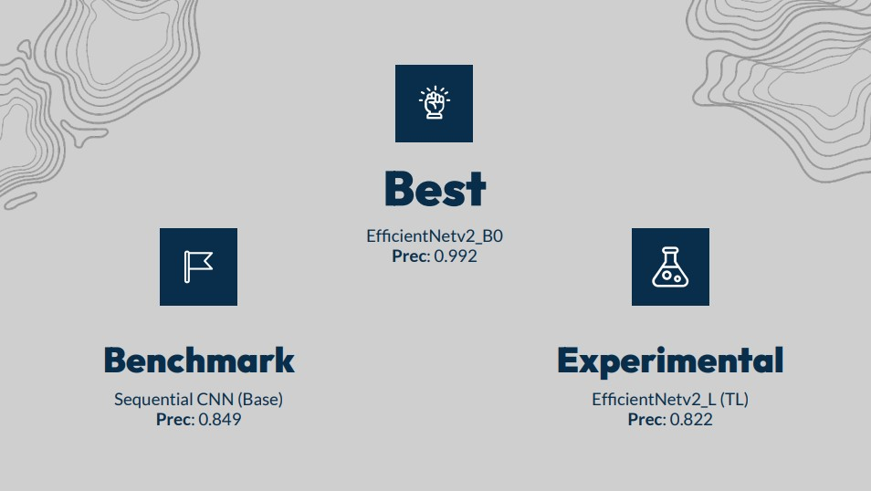
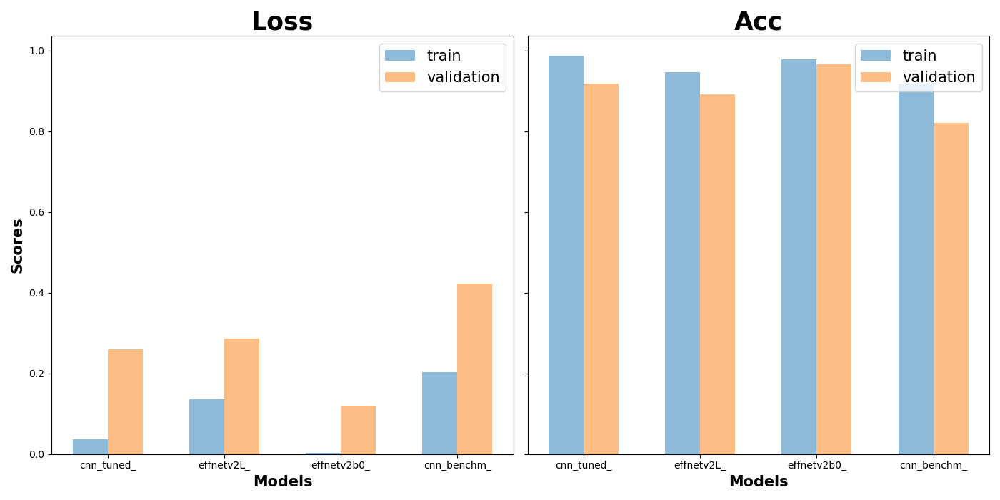
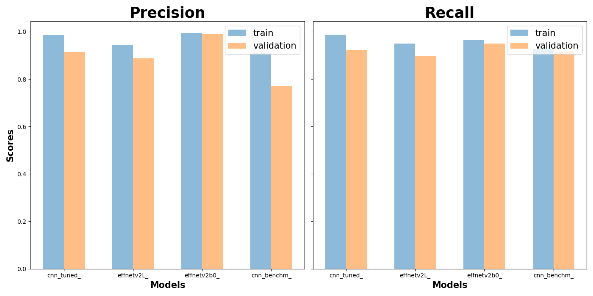

<!-- Back to top -->
<a name="readme-top"></a>

<!-- PROJECT LOGO -->
<br />
<div align="center">
  <a href="https://github.com/cdenq/sacramento-real-estate-eda">
    
  </a>

  <h3 align="center">Deepfake Image Detector</h3>

  <p align="center">
    CNN models trained to detect whether an image has been manipulated (deepfake). 
    <br />
    <br />
    <a href="https://github.com/cdenq/">GitHub Home</a>
    ·
    <a href="https://github.com/cdenq/deepfake-image-detector/issues">Report Bug </a>
    ·
    <a href="https://github.com/cdenq/my-directory">All Projects </a>
  </p>
</div>

<!-- Table of Contents -->
# Table of Contents
<details>
  <summary>Table of Contents</summary>
  <ol>
    <li>
      <a href="#live-demo">Live Demo</a>
    </li>
    <li>
      <a href="#exe-sum">Executive Summary</a>
    </li>
    <li>
      <a href="#started">Getting Started</a>
      <ul>
        <li><a href="#started-setup">Setup</a></li>
        <li><a href="#started-usage">Usage</a></li>
      </ul>
    </li>
    <li>
      <a href="#about">About The Project</a>
      <ul>
        <li><a href="#about-ps">Problem Statement</a></li>
        <li><a href="#about-bw">Built With</a></li>
      </ul>
    </li>
    <li>
      <a href="#process">Process</a>
      <ul>
        <li><a href="#process-setup">Data Sourcing, Cleaning</a></li>
        <li><a href="#process-work">Modeling, Analysis</a></li>
      </ul>
    </li>
        <li>
      <a href="#results">Results</a>
      <ul>
        <li><a href="#results-screen">Screenshots</a></li>
        <li><a href="#results-conclusion">Conclusions</a></li>
        <li><a href="#results-uncertain">Uncertanities</a></li>
      </ul>
    </li>
    <li><a href="#contact">Contact</a></li>
  </ol>
</details>

<!-- DEMO -->
<a name="live-demo"></a>
# Live Demo


<p align="right">(<a href="#readme-top">back to top</a>)</p>

<!-- Header -->
<a name="exe-sum"></a>
# Executive Summary

In an effort to combat a rising risks associated with accessible generative AI known as deepfakes, this project seeks to create a strong deepfake detector using 11 convolutional neural nets (CNNs). Data was taken from OpenForensics (an open-source dataset of labeled real and fake images), preprocessed, and fitted to 2 types of architectures of CNNs: Sequential models and EfficientNet models. The end result of these models peaked at a validation accuracy of 0.965 and precision of 0.992, with the strongest recommended model being the EfficientNet_v2B0 (located in the pre-trained models folder). Thus, this project recommended using the EfficientNet_v2B0 model for detecting the difference between deepfakes and real photographs.

This project provides pre-trained models as out-of-the-box solutions for business needs, saving users the time and compute! 





<p align="right">(<a href="#readme-top">back to top</a>)</p>

<!-- ABOUT THE PROJECT -->
<a name="started"></a>
# Getting Started

<a name="started-setup"></a>
## Setup

Download pre-reqs
```sh
pip install streamlit
pip install tensorflow
```
Clone repo
```sh
git clone https://github.com/cdenq/deepfake-image-detector.git 
```
Navigate to models folder and unzip
```sh
cd deepfake-image-detector/code/PretrainedModel/
unzip dffnetv2B0.zip
```
Navigate to streamlit folder
```sh
cd streamlit_deepfake_detector
```
Activate virtual environment in which you downloaded the pre-reqs into
```sh
source activate your_envs
streamlit run multipage_app.py
```
<p align="right">(<a href="#readme-top">back to top</a>)</p>

<a name="started-usage"></a>
## Usage

You are now able to choose between the `Detector` and `Game` modes to upload / check if images are deepfakes!

NOTE: This detector is trained on real and altered humans, meaning it struggles with cartoons or drawn images! The best performance comes with photo-realistic images.

<p align="right">(<a href="#readme-top">back to top</a>)</p>

<!-- ABOUT THE PROJECT -->
<a name="about"></a>
# About

<a name="about-ps"></a>
## Problem Statement

The rapid evolution of generative artificial intelligence (GPAI, LLMs) has rapidly increased the public’s access to powerful, deceptive tools. One such concern is the increasing prevalence of deepfake images, which pose a significant threat to public trust and undermines the epistemic integrity of visual media. These manipulated images can be utilized to spread false information, manipulate public opinion, and polarize communities, which can have serious consequences for both social and political discourse. 

This project aims to combat the spread of AI risks by developing a deep learning model that can detect differences between deepfakes and real images. Model are evaluated by their validation precision score, since a false-positive (deepfake labeled as real) was taken to be the more serious error.

<p align="right">(<a href="#readme-top">back to top</a>)</p>

<a name="about-bw"></a>
## Built With


<p align="right">(<a href="#readme-top">back to top</a>)</p>

<!-- ABOUT THE PROJECT -->
<a name="process"></a>
# Process

<a name="process-setup"></a>
## Data Collection and Cleaning

Data is taken from [OpenForensics](https://zenodo.org/record/5528418#.ZGaehnbMKHv), which is an open-source dataset used in the paper "Multi-Face Forgery Detection And Segmentation In-The-Wild Dataset" by Le, Trung-Nghia et al. Not much cleaning was needed besides `train_test_split`.

Preprocessing for modeling included image formatting to (256, 256) and scaling (done within the layers). For certain models, this project also applied data augmentation (rotation, flipping, etc.), which were also included in the layers.

<p align="right">(<a href="#readme-top">back to top</a>)</p>

<a name="process-work"></a>
## Modeling / Analysis

A total of 11 CNNs were trained across local and Google Collab instances. The results were aggregated, compared, and carefully selected to represent the main models shown in this repo.

<p align="right">(<a href="#readme-top">back to top</a>)</p>

<!-- CONCLUSIONS -->
<a name="results"></a>
# Results

<a name="results-screen"></a>
### Selected Screenshots




<p align="right">(<a href="#readme-top">back to top</a>)</p>

<a name="results-conclusion"></a>
### Conclusion

Based on the findings, this project recommends using the `EfficientNet_v2B0` model, which was the best performing model. This out-of-the-box solution would provide the highest scores of validation accuracy of 0.965 and validation precision of 0.992.

<p align="right">(<a href="#readme-top">back to top</a>)</p>

<a name="results-uncertain"></a>
### Uncertainties

Training data did not include further alterations besides the stock deepfake images (eg. the training data set did not include color tints, high contrast, blurred, etc.), while the testing data did. Thus, this project can achieve a higher performance by including such alterations in the data augmentation step. Likewise, increased time horizons and stronger compute can lead to more robust models.

<p align="right">(<a href="#readme-top">back to top</a>)</p>

<!-- CONTACT -->
<a name="contact"></a>
# Contact

To directly message me or setup a time to chat virtually, see my [contact page](https://github.com/cdenq#contact).

<p align="right">(<a href="#readme-top">back to top</a>)</p>
